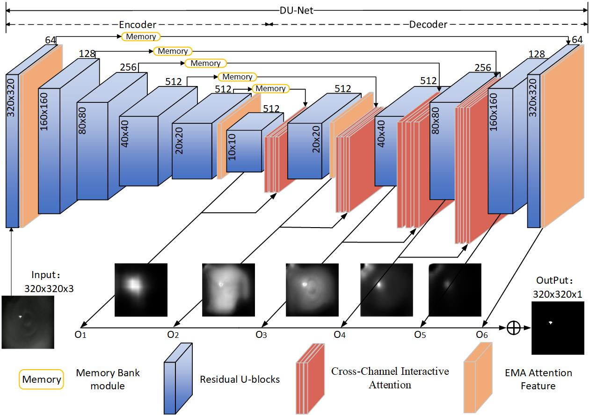

# DuNet:Infrared Small Target Detection based on Dual-path Attention UNet
---------------------

The code in this toolbox implements the ["DuNet:Infrared Small Target Detection based on Dual-path Attention UNet"](https://github.com/minqili/DuNet).
More specifically, it is detailed as follow.



## Install 
+ Environment
    ```
  conda create -n DUNet python=3.9
  conda activate DUNet
    ```
+ Please follow [official suggestions](https://pytorch.org/) to install pytorch and torchvision. We use pytorch=1.12.1-cuda11.3, torchvision=0.13.1
+ Requirements
    ```
  pip install -r requirements.txt
    ```

## Dataset preparation
* **Our project has the following structure:**
* you can download [MDvsFA](https://github.com/wanghuanphd/MDvsFA_cGAN) and [SIRST](https://github.com/YimianDai/sirst)
  ```
  ├──./datasets/
  │    ├── MdvsFA
  │    │    ├── images
  │    │    │    ├── 00000.png
  │    │    │    ├── 00000.png
  │    │    │    ├── ...
  │    │    ├── masks
  │    │    │    ├── 00000.png
  │    │    │    ├── 00000.png
  │    │    │    ├── ...
  │    │    ├── img_idx
  │    │    │    ├── train_MdvsFA.txt
  │    │    │    ├── test_MdvsFA.txt
  │    ├── ...
  │    ├── ...
  │    ├── SIRST
  │    │    ├── images
  │    │    │    ├── Misc_401.png
  │    │    │    ├── Misc_402.png
  │    │    │    ├── ...
  │    │    ├── masks
  │    │    │    ├── Misc_401.png
  │    │    │    ├── Misc_402.png
  │    │    │    ├── ...
  │    │    ├── img_idx
  │    │    │    ├── train_SIRST.txt
  │    │    │    ├── test_SIRST.txt
  
  ```

## System-specific notes

*exclamation: The model in `saved_models/DuNet` can be downloaded from the following baiduyun:*

Baiduyun: https://pan.baidu.com/s/1-fSlatkJ_8RC-FPlJeKu1Q?pwd=cqfb  (access code: cqfb)

Google drive: https://drive.google.com/file/d/1t9_7AR9gXf-FP5tXszGLHqJ0HK93VbPd/view?usp=sharing

## Train
```bash
python train.py
```

## Test
```bash
python test.py
```


